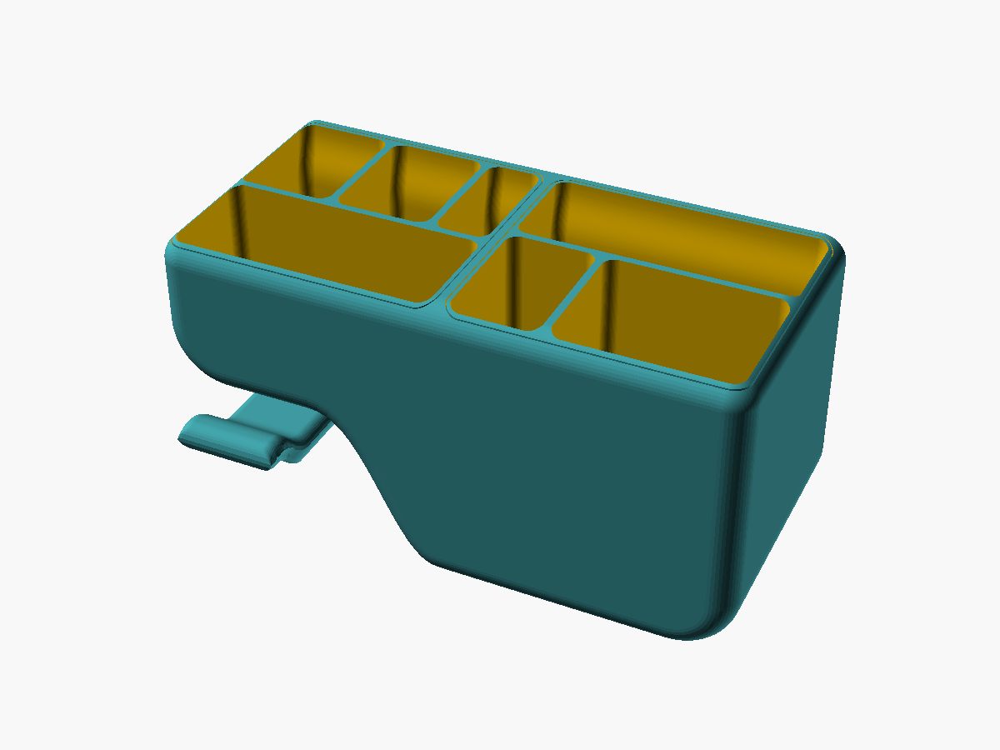
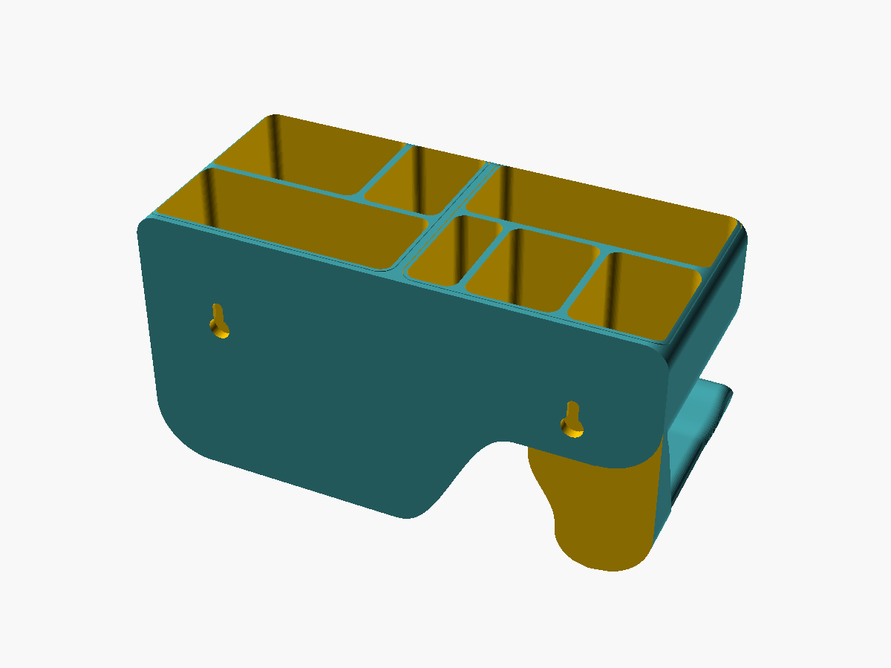
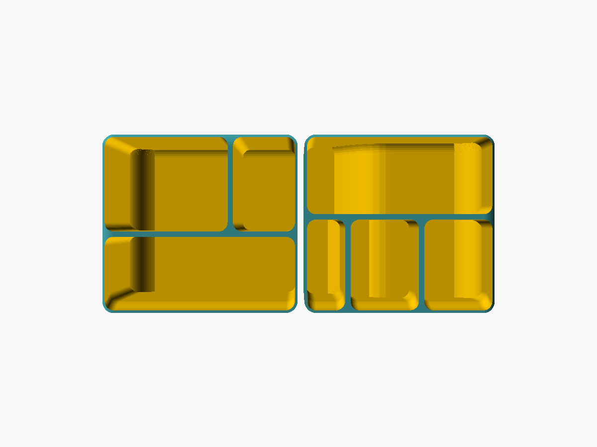
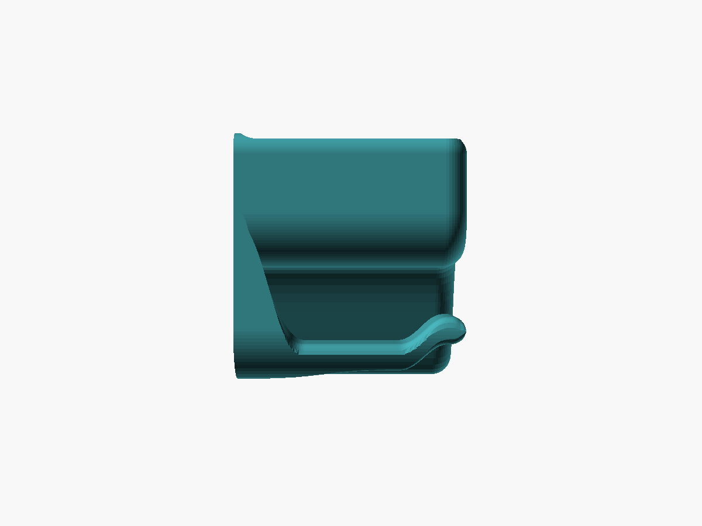
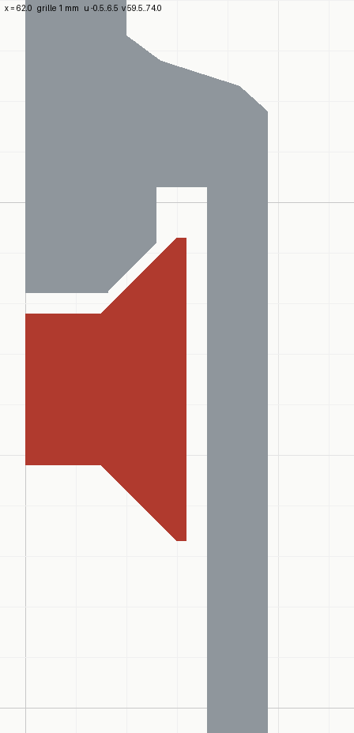
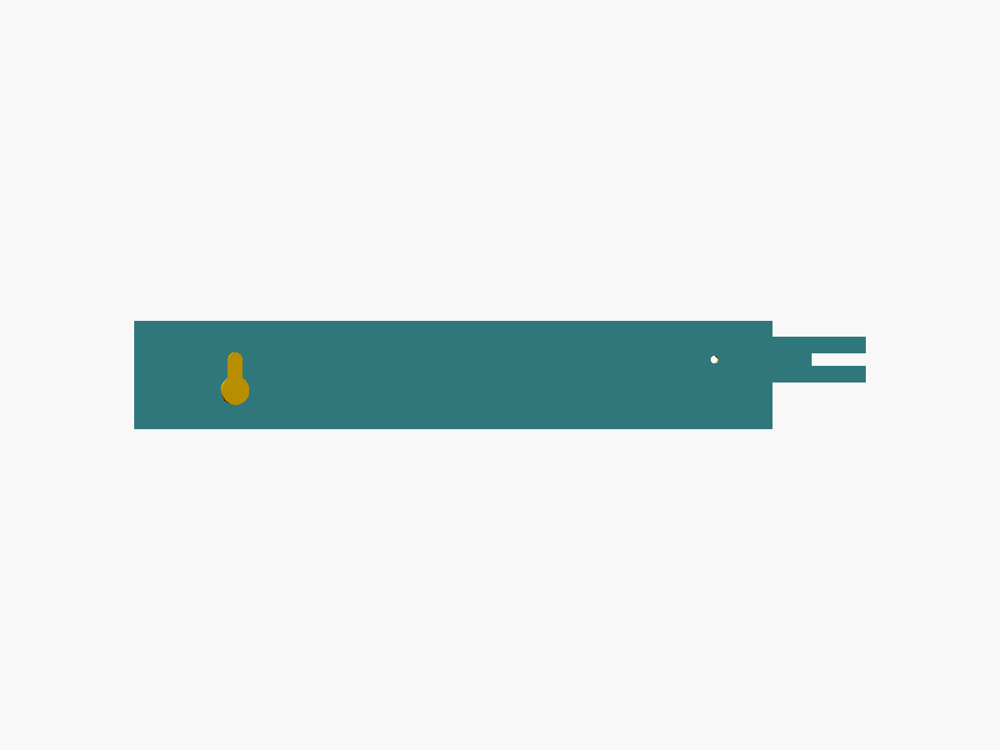

# vide-poches

Panier mural qui s'enfile par le haut sur deux vis à tête fraisée, en les gardant
invisibles. Fond à deux niveaux reliés par un galbe, crochet à casque sous la partie
haute, inserts amovibles qui bordent l'ouverture d'un liseré — de la couleur qu'on
veut.



| Le dos, côté mur | Les inserts, vus de dessus | De profil |
|---|---|---|
|  |  |  |
| deux trous de serrure, renflements cachés dans le bac | sept compartiments, deux corps | le crochet prolonge le dessous en S |

### Voir le modèle en 3D

GitHub affiche les fichiers `.stl` dans un **viewer 3D interactif** — clic-glisser pour
tourner, molette pour zoomer, et un bouton pour les télécharger :

- **[Coque](stl/vide-poches-coque.stl)** — 181 × 84,9 × 95 mm
- **[Inserts](stl/vide-poches-insert.stl)** — deux corps, 175,6 × 79,9 × 91,9 mm
- **[Gabarit de pose](stl/vide-poches-gabarit.stl)** — 189 × 28 × 4,8 mm
- **[Pièce d'essai](stl/vide-poches-essai.stl)** — les 10 derniers mm de la coque et des inserts

## 1. À quoi sert la pièce

Vider ses poches en rentrant — paquet de tabac, briquets, lunettes, câbles USB,
petites bricoles — et suspendre dessous un casque **Sony WH-1000XM5**, qui pèse 250 g
et ne se plie pas.

Elle s'accroche sur le flanc d'un meuble en bois, à deux vis **SPAX 3 × 12 à tête
fraisée** posées pour elle, à 124 mm l'une de l'autre. Relevé au pied à coulisse :
tête Ø 6, tige Ø 3, fraisure à 90° (cône de 1,5 mm) ; le petit bord cylindrique
au-dessus est estimé à 0,2.

La forme tient à trois choix :

- **Tout se range debout.** Les lunettes pliées passent de 150 × 46 au sol à 55 × 42,
  la poche à tabac de 105 × 30 à 85 × 30.
- **Le fond est à deux niveaux.** Un bac uniformément profond serait un puits où
  pêcher un briquet : il plonge à gauche (90 mm utiles pour ce qui tient debout) et
  remonte à droite (44 mm pour le vrac), par un galbe et non une marche.
- **Les vis sont invisibles.** La tête entre par un trou au bas de la course ; on
  pousse contre le bois et on descend de 8 mm, et elle se retrouve captive derrière
  une peau de 1,2 mm. Les renflements qui l'entourent sont sous l'arase, derrière
  les inserts.

## 2. Pièces à imprimer

| Pièce | `PIECE=` | Qté | Rôle |
|---|---|---|---|
| Coque | `coque` | 1 | dos, bac à deux niveaux, crochet |
| Inserts | `insert` | 1 jeu | deux petits bacs à séparations, un par zone — **deux corps** dans un même STL |
| Gabarit | `gabarit` | 1 | réglet à trou de serrure, repère de perçage, cale de profondeur — consommable |
| Pièce d'essai | `essai` | 1 | valide le jeu insert / coque **avant tout** |

```bash
python scripts/scad.py stl vide-poches -D PIECE=coque   --binaire
python scripts/scad.py stl vide-poches -D PIECE=insert  --binaire
python scripts/scad.py stl vide-poches -D PIECE=gabarit --binaire
python scripts/scad.py stl vide-poches -D PIECE=essai   --binaire
```

**Deux couleurs de PLA** : les inserts portent le liseré qui borde l'ouverture, et
dessinent dans une autre couleur un filet tout autour du bord, plus les séparations.

Coque et inserts se déduisent de la **même liste `cuves`** : un compartiment ajouté
ou déplacé met tout à jour.

## 3. Cotes principales

Mesurées sur les maillages exportés (moteur Manifold ; `--cgal` rend le même volume
au dixième de cm³).

| Pièce | Volume | Encombrement |
|---|---|---|
| Coque | 184,8 cm³ | 181,0 × 84,9 × 95,0 mm |
| Inserts (2 corps) | 143,0 cm³ (74,2 + 68,8) | 175,6 × 79,9 × 91,9 mm |
| Gabarit | 14,4 cm³ | 189 × 28 × 4,8 mm |

**Compartiments** — cotes utiles, entre parois d'insert :

| Objet | Largeur × profondeur | Hauteur utile | Pourquoi |
|---|---|---|---|
| Poche à tabac, debout | 85,0 × 30,0 | 90 | c'est elle qui fixe la largeur de la zone profonde |
| Lunettes, debout | **55,0** × 41,8 | 90 | à 50, les branches d'une monture large forçaient |
| Stylos, grands objets | 27,6 × 41,8 | 90 | ce qui reste de la zone profonde |
| Briquets, debout | 17,0 × 37,2 | 65 à 76 | Bic J26 et Clipper (16 d'épaisseur) ; replat à 76 |
| Câbles USB | 30,5 × 37,2 | 44 à 47 | replat à 47 : le galbe y montait à 60° contre la paroi |
| Petits objets | 30,5 × 37,2 | 44 | sur le plat |
| Petites bricoles | 82,8 × 34,6 | 44 à 70 | replat à 70 : sans lui, un puits de 90 côté cloison |

**Fixation** — de l'arrière vers l'avant, au droit de chaque vis :

```
bois | 1,6 de tige libre | fraisage : 1,0 dans la plaque | 0,4 de cône + 0,2 de bord | 0,4 de jeu | peau 1,2
     └──────────── plaque porteuse 2,6 ────────────┘└───────────── logement 1,0 ─────────────┘
```



*Coupe dans l'axe d'une vis (rouge) : la plaque porteuse est fraisée au cône de la
tête, avec 0,3 mm de jeu au rayon.*

| Cote | Valeur | Pourquoi |
|---|---|---|
| Dos, hors fixation | 2,0 mm | `dos_ep` — plein, le trancheur fait l'allègement |
| Dos au droit des vis | 4,8 mm | `dos_e` = plaque + logement + peau |
| Plaque porteuse | 2,6 mm | elle mord 1,0 mm dans le cône : la tête porte sur 19 mm² et s'y centre |
| Jeu au fraisage | 0,3 mm | `jeu_cone` — au rayon, donc aussi en axial à 45° ; 0,4 avec la cale de 1,8 |
| Peau avant | 1,2 mm | `dos_av` — trois passes de buse, elle ne porte rien |
| Course d'enfilage | 8 mm | `course` = rayon du trou d'entrée + rayon de la tête + 1 mm d'appui |
| Trou d'entrée / logement | Ø 7,5 / Ø 8,0 | le logement doit rester **plus large** que le trou qu'il prolonge |
| Axe des vis | 29 mm sous l'arase | au plus bas : le renflement droit se pose à 2 mm du fond peu profond |
| Entraxe | 124 mm | le renflement s'éteint 18 mm avant la paroi latérale, sans la toucher |

**Bac et inserts :**

| Cote | Valeur | Pourquoi |
|---|---|---|
| Parois / cloison / fond | 2,4 / 2,4 / 2,8 mm | `fond` ≠ `paroi`, sinon deux surfaces confondues (§6) |
| Marche entre les niveaux | 46 mm sur 45 de galbe | S quintique : rayon concave mini 17 mm, contre 7 en cubique |
| Arrondi de la face avant et des angles hauts | 8 mm | les deux rayons égaux, sinon angle vif sur la face avant |
| Jeu insert / coque | 0,3 mm par côté | `insert_jeu` — c'est aussi le filet entre les couleurs ; à valider sur `essai` |
| Paroi d'insert | 1,2 mm | trois périmètres ; elle porte le liseré |
| Paroi arrière d'insert | S de 5,1 à 2,3 mm du mur | passe devant les renflements puis recule : liseré de même largeur partout, 14° au plus fort |

**Crochet :**

| Cote | Valeur | Pourquoi |
|---|---|---|
| Portée | 84 mm | le bout arrive à 0,9 de la face avant |
| Creux de l'arceau | ~50 mm, 33 de fond plat | c'est ce creux qui fait que la sangle s'assoit au lieu de se percher |
| Passage sous la coque | 28 mm | la sangle et son coussin |
| Bras au plus fin | 10 mm | 0,3 MPa sous 250 g, contre ~20 MPa de cohésion entre couches |
| Butée | 10 mm, spatule relevée sur 20 | 43° au plus : imprimable sans support |
| Arrondi des arêtes | 4 mm, dessus et dessous | 40 % de l'épaisseur du bras |

Le crochet vu de face reprend la vague de la coque (flanc droit dans le prolongement,
coin de 20, flanc gauche en S) ; de côté, sa racine part tangente au dessous du panier.

## 4. Montage

L'ordre compte : le gabarit se pose sur la **première** vis, et c'est de là qu'il
reporte la seconde.



*Le gabarit vu côté mur : à gauche le trou de serrure, identique à celui du panier ;
à droite le repère de Ø 2 et la cale en fourche.*

0. **Imprimer d'abord le gabarit et la pièce d'essai.** L'anneau d'insert doit
   entrer dans l'anneau de coque sans forcer ni ballotter ; sinon, ajuster
   `insert_jeu`.
1. **Poser la première vis** là où le panier doit venir (avant-trou Ø 2 en bois
   tendre, Ø 2,5 en dur). C'est elle qui fixe la hauteur.
2. **Régler sa profondeur à la cale** : glisser la fourche sous la tête, à plat
   contre le bois, et visser jusqu'à ce que le cône en pince les bords. Elle se
   retire en forçant légèrement ; la tige libre fait 1,6 mm.
3. **Enfiler le gabarit** sur cette vis par son trou de serrure : présenter, pousser,
   descendre de 8 mm. Il doit être **captif**. S'il force, la vis est trop profonde ;
   s'il flotte, pas assez. **Si le gabarit ne s'enfile pas, le panier non plus.**
4. **Le mettre d'aplomb et marquer** à travers le repère. Rien sur la pièce ne
   garantit l'horizontale : un petit niveau, ou une mesure égale depuis le chant du
   meuble. Deux vis à des hauteurs différentes font vriller le panier.
5. **Percer, visser la seconde vis**, et la régler à la même cale.
6. **Présenter la coque** les têtes en face des trous d'entrée, **pousser** contre
   le bois, **descendre de 8 mm** : elle vient en butée seule.
7. **Poser les deux inserts**, chacun dans sa zone, à la verticale.

Pour décrocher : remonter de 8 mm, tirer vers soi.

## 5. Impression

- **Coque couchée sur son dos.** La direction de construction est la profondeur : la
  silhouette de la façade sort sans support, et toute surface tournée vers l'avant
  est un toit qui se pose sur la couche du dessous. Seul l'arrière est contraint, et
  il est plat.
- **Inserts à plat, fond contre le plateau.** Seul support du projet : sous le fond de
  l'insert peu profond, qui suit le galbe (~40 g, face cachée).
- **Gabarit à plat**, dans la même orientation que la coque : le pontage de sa peau
  est représentatif de celui du panier.
- **PLA**, remplissage libre : aucune cavité fermée dans aucune pièce.
- Emprise : 181 × 95 mm pour la coque ; 181 × 176 pour la pièce d'essai.

## 6. Contraintes à connaître avant de modifier

**Fixation**

- **Le fraisage ne tolère l'erreur que dans un sens.** Vis trop profonde : la plaque
  ne passe plus. Pas assez : un peu plus de jeu. D'où la cale de **1,8** et non 1,7 —
  1,7 n'est pas un multiple de la couche de 0,2, et le cône écrase le PLA en pinçant ;
  les deux poussent du côté qui coince. Chaque dixième de fourche est un dixième de
  profondeur de vis.
- **Le fraisage doit épouser le cône.** Un chanfrein parallèle mais décalé au rayon
  ne le touche jamais — la tête n'appuie qu'après que le panier a avancé d'autant.
  Vérifier en plaçant la vraie vis dans le canal.
- **`porteur` < fin du cône**, sinon la plaque bute sur le bord cylindrique de la tête.
  Assertion.
- **Le logement de tête reste plus large que le trou d'entrée**, et le fraisage se
  prolonge de 0,3 mm dans le logement : à égalité ou à fleur, les contours coïncident
  (116 arêtes non-variété). Assertions.
- **`z_vis` se déduit du fond, par le bas.** Plus haut, le S de la paroi arrière de
  l'insert se raccourcit ; il faut 10 mm libres au-dessus des renflements. Assertion.
- **Le renflement est ajouté après le creusement du bac**, sinon il disparaît avec lui.
  Il reste sous l'arase (assertion) et au-dessus du fond peu profond (assertion).

**Bac et inserts**

- **Les cavités sont découpées dans l'enveloppe intérieure**, jamais posées à un
  niveau : le dessous remonte vers les coins, et un fond plat y débouchait.
- **Le fond suit le galbe (`plancher`)**, balayé avec le même arrondi avant que
  l'enveloppe intérieure. Extrudé droit, il se confondait avec elle sur tout le galbe.
- **Les replats (briquets, câbles, bricoles) sont pleins dessous.** Creux, le fond de
  1,6 mm pendait au-dessus du vide, tenu par deux côtés.
- **Tous les compartiments au même congé**, et chacun entièrement dans une zone :
  sinon un fragment d'insert se détache, ou le compartiment disparaît.
- **Le dessus des inserts est rogné par la surface extérieure de la coque** : c'est ce
  qui prolonge l'arrondi du bord. Un dessus plat dépasserait.
- **Les coins sont dessinés en plan (`zone_2d`, `r_arr` = 5,7)**, pas laissés au
  balayage, qui les coupait à 44°. Les 0,1 au-delà de 5,6 évitent que le congé naisse
  dans le plan de l'arrondi avant.
- **Le socle du côté peu profond reste plein** : creux, c'était une cavité scellée
  qu'aucun trancheur ne sait soutenir.

**Crochet**

- **Il est l'intersection d'un champ de hauteur (profil de côté) et d'un prisme (vue
  de face)**, et sa racine part 0,3 mm dans la coque pour ne pas lui être tangente.
- **Les congés des arêtes se placent par leur centre**, tangents aux deux faces. Mesurer
  la distance au flanc à plat laissait une marche ; la résoudre par itérations
  oscillait et dessinait des fissures. Au dessus, où l'angle est obtus, le congé finit
  sur le flanc plutôt que de plafonner en bande plate.
- **Le rayon se resserre au bout de la spatule** (demi-épaisseur locale) et s'éteint
  là où le dessus touche encore le panier.
- **Bornes sous assertion** : spatule à 45° au plus (1,875·`croc_r_z` ≤ `croc_gorge`),
  creux ≥ 40 mm, `croc_l` ≤ `prof`, racine et spatule sans chevauchement.

**Coïncidences** — le moteur Manifold transforme en arêtes non-variété ce que CGAL
fusionnait en silence. Règle générale : deux surfaces ne doivent ni se confondre, ni
se toucher tangentiellement, ni partager un plan de départ ; on décale de quelques
centièmes, ou on fait chevaucher franchement.

**Tests permanents**, lancés comme une pièce :

| `PIECE=` | Vérifie | Attendu |
|---|---|---|
| `descente` | que les inserts descendent malgré les renflements | **vide** |
| `peau` | qu'il reste de la matière devant chaque logement de tête | **plein**, 115 mm³ |
| `jointure` | qu'aucun jour ne reste entre le crochet et le dessous de la coque | **vide** |

`scad.py` masque le message « Current top level object is empty » : lancer OpenSCAD
directement pour lire le résultat.

## 7. Points de vérification

- [ ] **Pièce d'essai** : l'insert entre sans forcer ni ballotter (jeu de 0,3).
- [ ] **Cale** : mesurée au pied à coulisse, 1,8 d'épaisseur et 3,4 de fente.
- [ ] **Gabarit enfilé sur une vis réglée** : la tête passe le trou d'entrée, la plaque
      glisse sous le cône, il est captif en haut de course, et la peau de 1,2 est
      sortie propre sur son pontage.
- [ ] **Bord de la tête SPAX** : estimé à 0,2 ; le logement ne laisse que 0,4 de jeu
      devant. Plus haut, remonter `loge_e`.
- [ ] **Paroi arrière en S** : l'insert descend sans frotter, et le S ne marque pas à
      la lumière.
- [ ] **Insert peu profond** : supports faciles à retirer, et il repose sans basculer.
- [ ] **Sangle du XM5** : largeur au réglet (le crochet est dimensionné pour ~38 mm)
      et épaisseur coussin compris, face aux 28 mm de passage.
- [ ] **Tenue des objets debout** : lunettes dans 55 × 42 × 90, blague à tabac dans
      85 × 30.

---

Les images de `doc/` et les STL de `stl/` sont des copies figées des sorties de
`scripts/scad.py`. Après une modification du `.scad`, les régénérer et les recopier :
`scad.py check vide-poches` ne surveille que `out/`.
